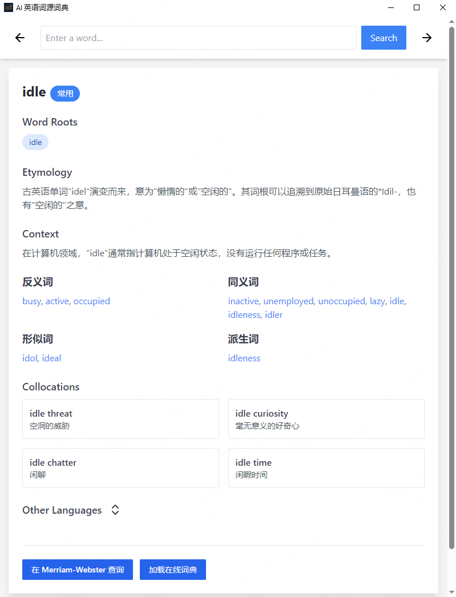

# AI 英语词源词典


本地内置了四六级、托福词汇表的单词的信息，词表来源于[常用英语词汇表](https://github.com/mahavivo/english-wordlists)。内置信息包括：

- 词源
- 使用场景
- 同义词
- 反义词
- 形似词
- 派生词

以上信息均由 AI 生成，不保证准确。另外，可在线查询英英词典，或打开 Merriam-Webster 页面了解更多单词信息。

## 下载

Windows 便携版（12.9 MB）[Github releases](https://github.com/SSShooter/en-etymology-dict/releases)

## 技术栈

- Vite
- React
- TypeScript
- Tauri

## 数据库

数据库文件位于 `public\english_etymology.db`，数据库设计：

```sql
-- Main words table
CREATE TABLE IF NOT EXISTS words (
    id INTEGER PRIMARY KEY AUTOINCREMENT,
    word TEXT NOT NULL UNIQUE,
    frequency TEXT CHECK (frequency IN ('very_common', 'common', 'uncommon', 'rare', 'archaic')),
    etymology TEXT,
    context TEXT,
    related_words TEXT,      -- 合并 related_words 表
    similar_words TEXT,      -- 合并 similar_looking_words 表
    antonyms TEXT,          -- 合并 antonyms 表
    synonyms TEXT,          -- 合并 synonyms 表
    derivatives TEXT,       -- 合并 derivatives 表
    created_at DATETIME DEFAULT CURRENT_TIMESTAMP
);

-- 词根字典表
CREATE TABLE IF NOT EXISTS root_dictionary (
    id INTEGER PRIMARY KEY AUTOINCREMENT,
    root TEXT NOT NULL UNIQUE
);

-- 词根关联表
CREATE TABLE IF NOT EXISTS word_roots (
    word_id INTEGER NOT NULL,
    root_id INTEGER NOT NULL,
    PRIMARY KEY (word_id, root_id),
    FOREIGN KEY (word_id) REFERENCES words(id) ON DELETE CASCADE,
    FOREIGN KEY (root_id) REFERENCES root_dictionary(id) ON DELETE CASCADE
);

-- Other languages
CREATE TABLE IF NOT EXISTS other_languages (
    id INTEGER PRIMARY KEY AUTOINCREMENT,
    word_id INTEGER,
    lang TEXT NOT NULL,
    meaning TEXT NOT NULL,
    words TEXT NOT NULL,
    FOREIGN KEY (word_id) REFERENCES words(id) ON DELETE CASCADE
);

-- Collocations
CREATE TABLE IF NOT EXISTS collocations (
    id INTEGER PRIMARY KEY AUTOINCREMENT,
    word_id INTEGER,
    item TEXT NOT NULL,
    translate TEXT NOT NULL,
    FOREIGN KEY (word_id) REFERENCES words(id) ON DELETE CASCADE
);

-- Create indexes for better query performance
CREATE INDEX IF NOT EXISTS idx_words_word ON words(word);
CREATE INDEX IF NOT EXISTS idx_root_dictionary_root ON root_dictionary(root);
CREATE INDEX IF NOT EXISTS idx_word_roots_root_id ON word_roots(root_id);
CREATE INDEX IF NOT EXISTS idx_word_roots_word_id ON word_roots(word_id);
CREATE INDEX IF NOT EXISTS idx_other_languages_word_id ON other_languages(word_id);
CREATE INDEX IF NOT EXISTS idx_collocations_word_id ON collocations(word_id);

```

## 截图



## 感谢

- [常用英语词汇表](https://github.com/mahavivo/english-wordlists)